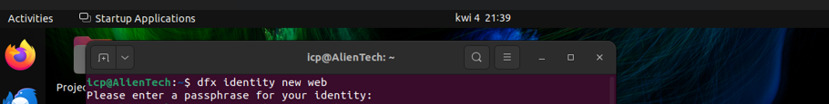
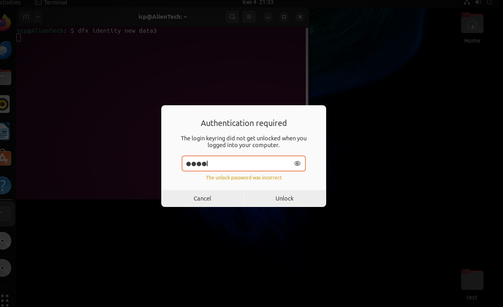
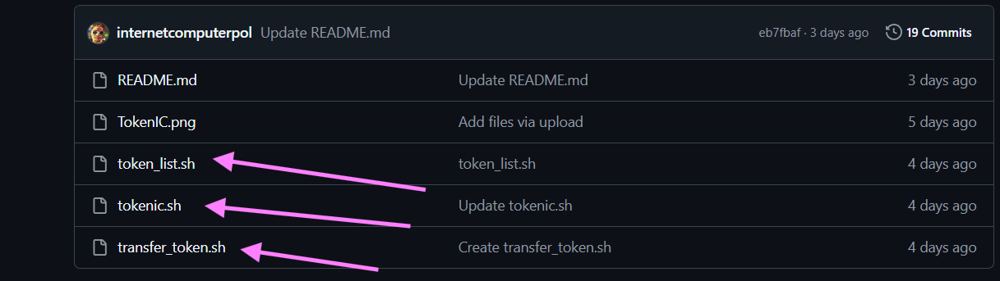

Połączenie Internet Identity z Tokenem ICRC-1 na lokalnej replice

Opis
-----------------------------

Ten przewodnik opisuje sposób integracji Internet Identity z tokenem utworzonym na lokalnej replice (ICRC-1). DApp pozwala na logowanie za pomocą lokalnego Internet Identity, a następnie wykonywanie transferów tokena do innych użytkowników posiadających Internet Identity.

Schemat działania
- Internet Identity **l3uwz-kk4se-(...)** przelewa **500 Tokenów XYZ** do Internet Identity **7d5uu-nagqm-(...)**.
- Wszystko odbywa się w aplikacji DApp stworzonej w **Vue.js**, która obsługuje sesję Internet Identity na frontendzie.

------------------------------

Instrukcja

👨‍🚀 A
1. Tworzenie Identity 🪪
--------------------------------------------
Najpierw tworzymy dwia identity: `capo` oraz `boss`.

```sh
dfx identity new capo
```
```sh
dfx identity new boss
```
------------------------
PROSI O PODANIE Hasła dla Identity 🧐
Please enter a passphrase for your identity: 

SOLUCJA PYTA O HASŁO START ( Jeżeli nie macie tego problemu przejdzcie do punktu 
-----------------------

☢️
Jeżeli nie macie spiętego keyringa = przy tworzeniu identity prosi was o hasło dla identity
Normalnie powinno to śmigać, ale czasami po wpisaniu 

> dfx identity new nazwa_identity_nowego

pojawia się prompt o podanie hasła



------------------------
Dzieje się tak dlatego, że:
dfx korzysta z funkcji keyring systemowego do przechowywania kluczy tożsamości.
Systemowy keyring (czyli „magazyn kluczy”) w Ubuntu to mechanizm zarządzania hasłami i innymi danymi uwierzytelniającymi.

Od wersji 0.13.0, dfx wprowadził wsparcie dla systemowego keyringa.
-------------------------------------------
Narzędzie dfx przy tworzeniu new identity działa mniej więcej tak:

* Najpierw dfx próbuje użyć systemowego keyringa
* Jeśli keyring nie jest dostępny, używa plików zaszyfrowanych hasłem
* Opcjonalnie można wymusić tryb plaintext (niezaszyfrowany Tego nie polecam )

Jeśli dfx nie może uzyskać dostępu do keyringa systemowego, automatycznie przechodzi do trybu szyfrowanego hasłem.


Rozwiązanie odpalcie skrypt reinstalacji ( zakładam, że macie spiętą wirtualkę tylko pod ICP  Developerkę ) :
Reinstall wywali wszystkie zapisane klucze jak to środowisko dev to spoko. 
Możecie spróbować 

1) Upgrade systemu Ubuntu do najnowszej wersji

```sh
sudo apt update
sudo apt-get upgrade
```

2) Reinstall pakietów GNOME keyring do zarządzania kluczami tożsamości 

```sh
sudo apt install --reinstall gnome-keyring
sudo apt install libsecret-1-0 libsecret-1-dev
gnome-keyring-daemon --start

```

3) Warto po wszystkim wykonać reboot systemu

```sh
reboot

```
Po wpisaniu dfx new identity nazwa_konta może wyskoczyć takie okno z promptem o podanie poświadczeń root ( wpiszcie hasło roota w takim przypadku )




------------------------------------------------- 
SOLUCJA PRZY HAŚLE END


👨‍🚀 B

2. Logowanie do Identity `capo` 🪪

```sh
dfx identity use capo
```

3. Uruchamianie skryptu `tokenic.sh` zakładam wrzucicie go do tego samego katalogu 

```sh
bash tokenic.sh
```

Skrypt oraz inne pomocne narzędzia znajdują się tutaj:


> https://github.com/internetcomputerpol/TokenIC

------------------------------------------------- 
Obsługa skryptu

👨‍🚀 C 

Po uruchomieniu skryptu:
----------------------------------
- Wybieramy **boss** jako konto mintujące.
- Wybieramy **capo** jako konto do przelewu całości tokenów.
----------------------------------

Po zatwierdzeniu otrzymujemy **kanister z tokenem** na lokalnej replice. **Kontrolerem kanistra jest `capo`.**

-------------------------------------------------
Tworzenie nowego projektu DApp

👨‍🚀 D

Otwieramy nowy terminal i upewniamy się, że używamy identity `capo`:

```sh
dfx identity whoami
```
Jeśli nie jesteśmy zalogowani jako capo 🪪:

```sh
dfx identity use capo
```

Następnie tworzymy nowy projekt:

```sh
dfx new fillia
```

Wybieramy:
- **Motoko** jako backend.
- **Vue.js** jako frontend.
- **Internet Identity** jako opcję logowania.

5. Tworzenie Internet Identity

Przechodzimy do lokalnego kanistra **Internet Identity** i tworzymy kilka nowych kont **II**.


                  
-----------------------------------------------
Połączenie Internet Identity z Tokenem 
-----------------------------------------------

Tworzenie nowego projektu DApp

👨‍🚀 E

w Terminalu musisicie zainstalować Ledger-IC w celu połączenia się z kanistrem ( u siebie) tokena icrc-1 z poziomu frontendu
należy łączyć się z poziomu frontendu ponieważ w plikach sesji znajduje się poświadczenie II i po tym poświadczeniu 
kanister ledgera będzie wiedział, że dane połączenie jest zautoryzowane właściwym Internet Identity. 

w Terminalu wpiszcie 

```sh
npm install @dfinity/auth-client @dfinity/agent @dfinity/principal @dfinity/ledger-icrc
```
------------------------------------------------
6. Podmieńcie zawartość App.vue z tą z GitHub

👨‍🚀 F  

> https://github.com/internetcomputerpol/InternetIdentity-Ledger/blob/main/App.vue

-------------------------------------

7. Po przekopiowaniu podmieńcie dowiązanie do waszego backendu w Motoko ( u was może być inne zależnie od tego jak nazwaliście projekt )

👨‍🚀 G

> import u mnie : import { filia_backend } from 'declarations/filia_backend/index';

u was może być inna nazwa np. import { twojaNazwaBackendu_backend } from 'declarations/TwojaNazwaBackendu_backend/index';

-----------------------------------
8. Po zmianach i zapisuaniu wpisujemy ( jako identity capo !!! ) 
👨‍🚀 H

```sh
dfx deploy
```
-----------------------------------
9. Problem Gołych kont nasze identity nie mają Tokena ?
👨‍🚀 I

Nasze identity nie mają tokena ponieważ całość tokena posiada identity capo. 
Po utworzeniu Identity i zalogowaniu będziemy mogli odczytać Internet Identity utworzonych II. 

Przybierają one przykładowo taką formę: 64xl6-hhulc-irrz2-ovw2t-znlmw-onjwx-3yey6-gp6m7-pflyk-rjt75-xae

aby zasilić tokenami dane Internet Identity musimy w pierwszej kolejności uruchomić Terminal 
wpisać ( dla pewności ) 

```sh
dfx identity use capo
```

a następnie uruchomić skrypt transferu dostępny tutak na GitHub:

> https://github.com/internetcomputerpol/TokenIC/blob/main/transfer_token.sh

ZAZNACZONE PLIKI KTÓRE WARTO PRZEKOPIOWAĆ Z REPOZYTORIUM PODANEGO WYŻEJ


uruchamiamy poleceniem

```sh
bash transfer_token.sh
```


1. ( jeżeli jesteśmy capo ) to nie przelogowujemy się ( wpisujemy nie )
2. wklejamy id principala czyli ( przykładowe 64xl6-hhulc-irrz2-ovw2t-znlmw-onjwx-3yey6-gp6m7-pflyk-rjt75-xae ) 
3. podajemy ilość tokenów do transferu
4. Jeżeli zwróci nam Variant w podobnej postaci to transfer został wykonany (variant { Ok = 45 : nat })

Teraz nasze Internet Identity posiada token możemy za pośrednictwem tego konta rozesłać Token do innych II.


--------------------------------------------------------------------

